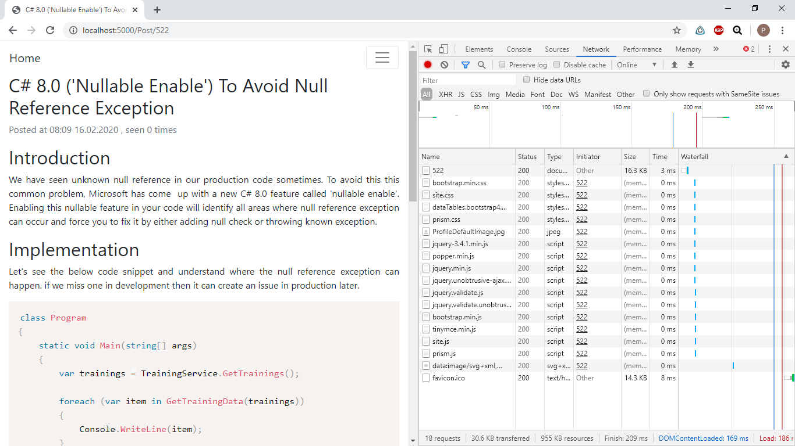

# Blog Engine
ASP NET Core 2.2 Web project

Although this is my first ASP project it features quite a good performance. This has been achieved by:
- All static files are client-side cached
- Most common resources (Profile/Index/Post pages) are fully server-side response cached for unauthenticated user, effectively 90% of all requests will be fully cached what lead to response time less than 5 ms (acording to Chrome Dev Tools). While serving these request Db queries are not performed. The dveloped custom caching infrastracture allows having multiple caches for the same route with diferent scopes (e.g. scoped to users in moderator role, scoped to unauthenticated users... etc). The custom cache supports execution of a cache handler method which is called each time cache is served and allows, for example, adding view statistic update logic. The cache also  supports expiration by key and/or route parameters.
- Heavy resources like table of all users inside AdminPanel are also response cached
- View statistics are server cached so there are no Db update queries on each Post/Commentary/Profile request, only after 5 minutes view statistic changes are commited to the database
- Lazy Loading is not utilized (though it has been used initially), Db queries are performed mostly by Select and Eager loading, sometimes via Explicit loading

Post page cache setup code:

```csharp
[ServerResponseCache(3600, CachePolicy.UNAUTHENTICATED_USER_SCOPED, CacheManagerService.POST_GET_CACHE_KEY)]
public async Task<IActionResult> OnGetAsync([Required]int id)
{
    ....
    await S.CacheManager.CacheManager.SetRequestDataAsync(viewStatistics);
    ....
}

[ServerResponseCacheHandler(CacheManagerService.POST_GET_CACHE_KEY)]
public static async Task HandelCachedOnGetAsync(CacheScope scope)
{
    var services = scope.ServiceProvider.GetService<ServiceLocator>();
    var viewStatistics = scope.RequestData.To<IViewStatistic[]>();

    await updateViewStatisticAsync(services.DbUpdator, false, viewStatistics);
}
```

Post page cache policy:

```csharp
[Service(ServiceType.SINGLETON, typeof(ICachePolicy))]
class UnauthenticatedUserScopedCachePolicy : ICachePolicy
{
    public async Task<bool> CanBeSavedAsync(HttpContext httpContext, IServiceProvider serviceProvider)
    {
        return httpContext.User?.Identity?.Name == null;
    }

    public async Task<object> GenerateMetadata(HttpContext httpContext, IServiceProvider serviceProvider)
    {
        return null;
    }

    public async Task<bool> CanBeServedAsync(HttpContext httpContext, IServiceProvider serviceProvider, object metadata)
    {
        return httpContext.User?.Identity?.Name == null;
    }
}
```

ModeratorPanel cache policy (as an example of more complicated logic):

```csharp
[Service(ServiceType.SINGLETON, typeof(ICachePolicy))]
class ModeratorPanelScopedCachePolicy : ICachePolicy
{
    public async Task<bool> CanBeSavedAsync(HttpContext httpContext, IServiceProvider serviceProvider)
    {
        return await tryGetCurrentUserModeratorsGroupIdAsync(serviceProvider) != null;
    }

    public async Task<object> GenerateMetadata(HttpContext httpContext, IServiceProvider serviceProvider)
    {
        return await tryGetCurrentUserModeratorsGroupIdAsync(serviceProvider);
    }

    public async Task<bool> CanBeServedAsync(HttpContext httpContext, IServiceProvider serviceProvider, object metadata)
    {
        var cacheOwner = metadata.To<int>();
        var cacheTarget = await tryGetCurrentUserModeratorsGroupIdAsync(serviceProvider);

        return cacheTarget == cacheOwner;
    }

    async Task<int?> tryGetCurrentUserModeratorsGroupIdAsync(IServiceProvider serviceProvider)
    {
        var utilities = serviceProvider.GetService<UtilitiesService>();
        var userQuery = await utilities.GetCurrentUserAsQueryableAsync();
        if (userQuery == null)
        {
            return null;
        }
        else
        {
            var user = await userQuery.Include(u => u.ModeratorsGroup)
                .Where(u => u.Role == DBModels.Role.MODERATOR)
                .AsNoTracking()
                .SingleOrDefaultAsync();
            return user?.ModeratorsGroup?.Id;
        }
    }
}
```

Post page response time (unauthenticated user):



There are some images that will provide you an insight into the the blog's features!

The main page:


The "post create" page with rich styling capabilities. All input (even images) is sanitized by allowing only white-listed tags and attributes to be submitted to the database, therefore XSS attack is hardly possible.


The post's appearance:


Post's commenting section:


Administrator panel overview tab. ChartJS powered/AJAX loaded/server-side cached


Administrator panel moderators info tab. Shows time to resolving a "problem situation" (post moderation/checking users receiving too many reports... etc)


The list of all publication. Powered by JQuery DataTables with AJAX source and caching:


List of all users with some useful information:


Typical profile page:


List of user's violations/reports/actions inside profile page:


