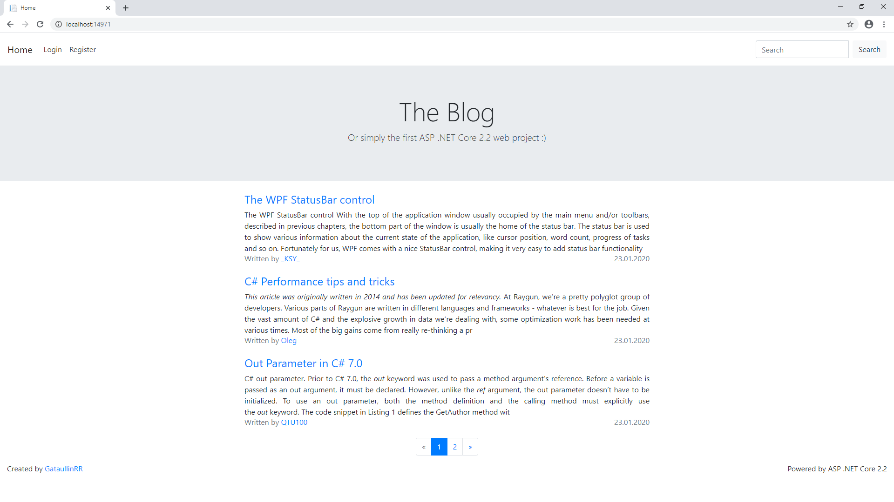
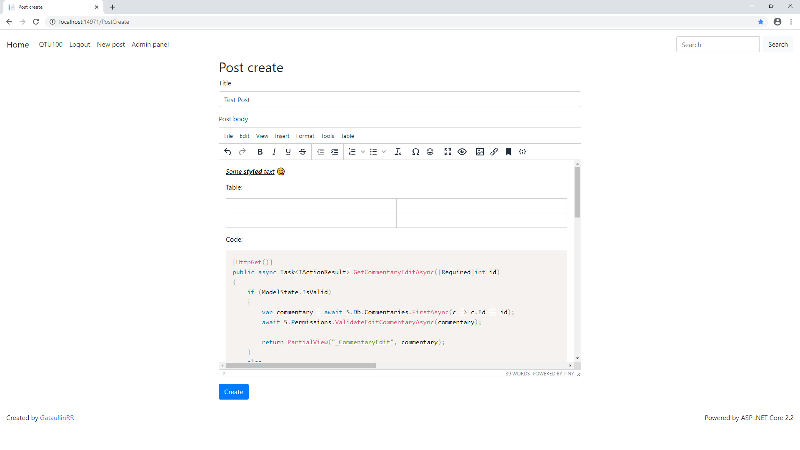
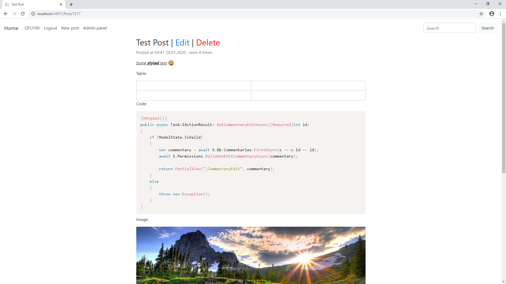
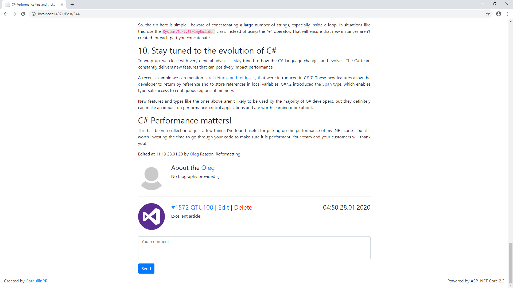
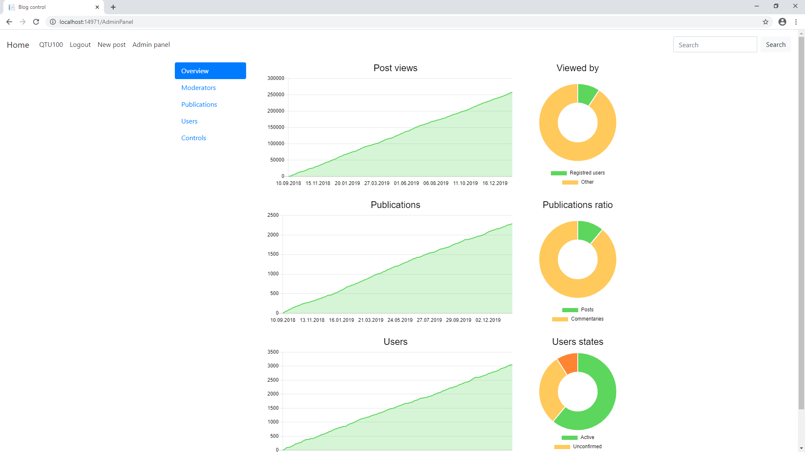
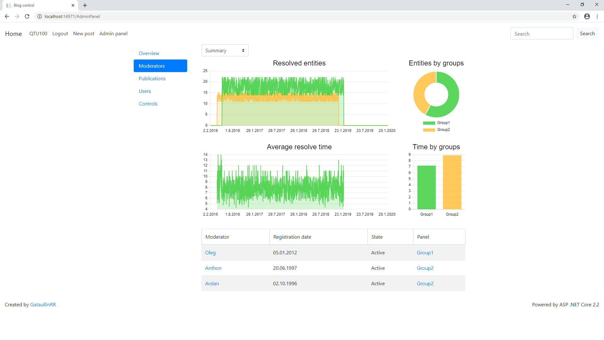
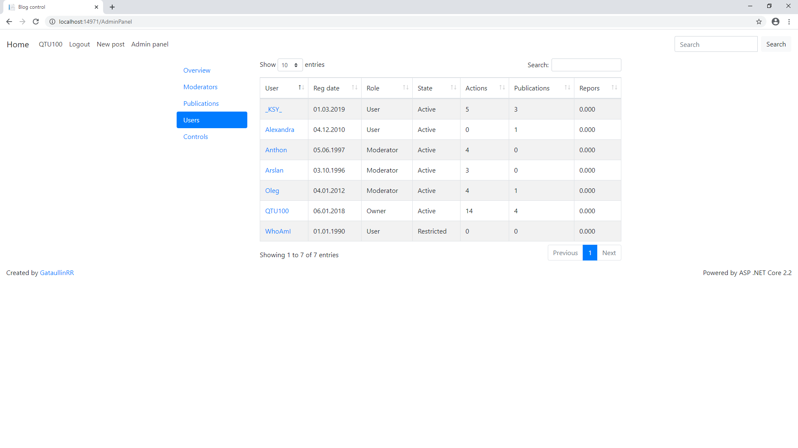
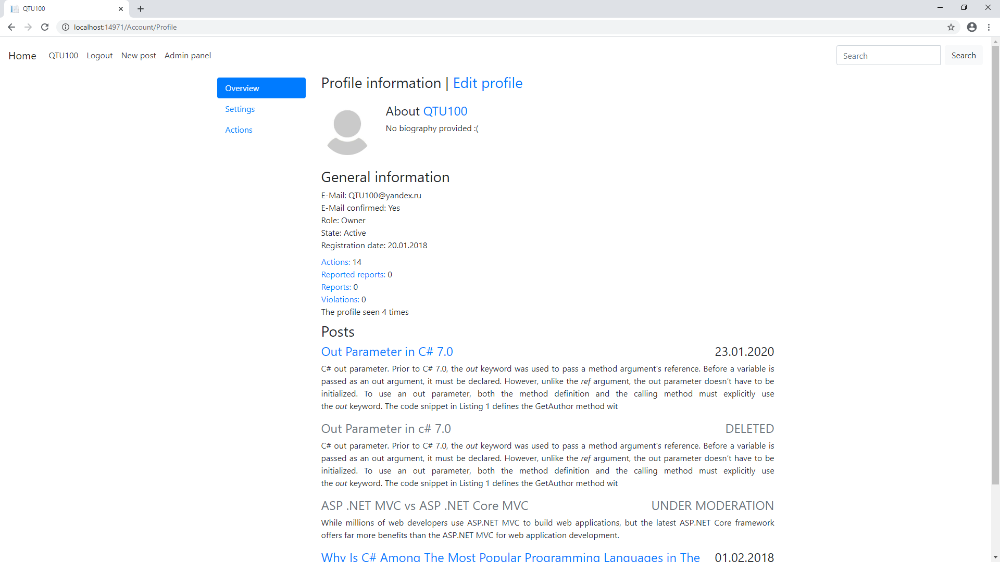
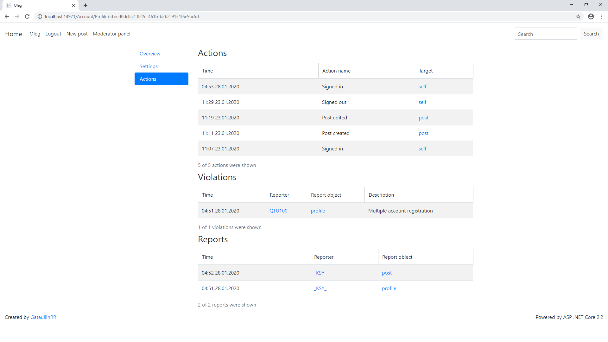

# Blog
First ASP NET Core 2.2 Web project

There are some images that will tell you more about the blog's fetures!

Main page:

Post create page with rich styling. All input is sanitized by allowing only white-listed tags and attributes.

The post appearance

Commenting section 

Administrator panel's overview tab. ChartJS powered/AJAX loaded/server-side cached

Administrator panel's moderators' info tab. Shows time for resolving a "problem situtaion" (post moderation/checking user making to many reports)

The list of all publication. Powred by JQuery DataTables with AJAX loading and caching

List of all users with some useful information

Typical profile page

List of user's violations/reports/actions inside profile page

