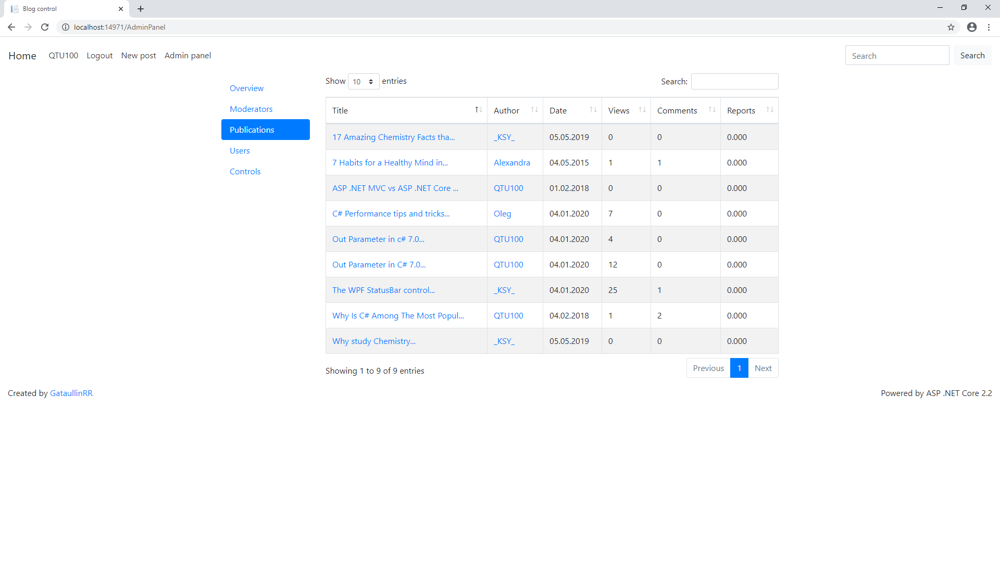

# Blog
First ASP NET Core 2.2 Web project

There are some images that will provide you an insight into the the blog's features!

The main page:

Post create page with rich styling. All input (even images) is sanitized by allowing only white-listed tags and attributes to be subbmitted to the database. Therefore XSS atack is hardly possible.

The post's appearance

Post's commenting section 

Administrator panel's overview tab. ChartJS powered/AJAX loaded/server-side cached

Administrator panel's moderators' info tab. Shows time for resolving a "problem situtaion" (post moderation/checking users receiving too many reports)

The list of all publication. Powered by JQuery DataTables with AJAX source and caching

List of all users with some useful information

Typical profile page

List of user's violations/reports/actions inside profile page

